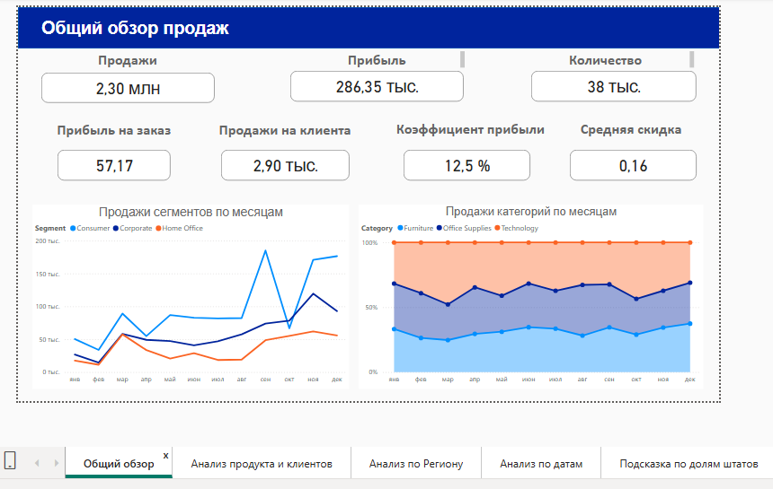
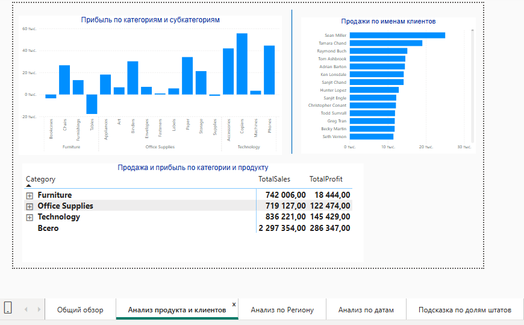
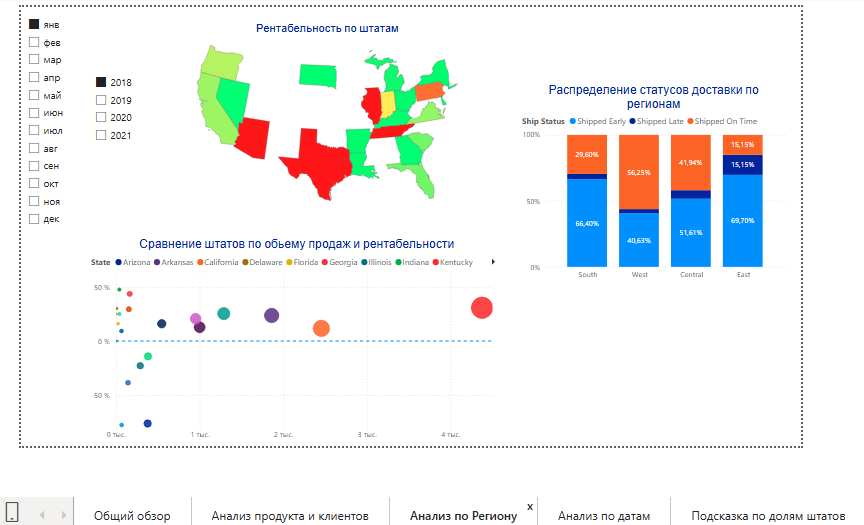

# Powerbi_report
Описание :
- Анализ продаж (Sample_Superstore_Orders)
Дашборд в Powerbi для анализа продаж и прибыльности:
- Общие показатели : продажи, прибыль, рентабельность
- Анализ по регионам(продажи vs прибыль)
- Динамика по датам и срезам.
Выводы:
-рентабельность сильно отличается по регионам.
- есть регионы с высокими продажами, но низкой прибылью.

[Скачать отчет](ДЗ_урок_56.pbix) 
 
----- Скрин дашборда: 

